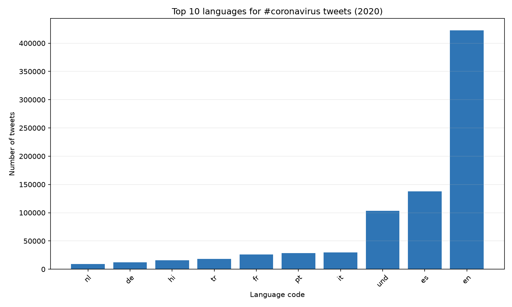
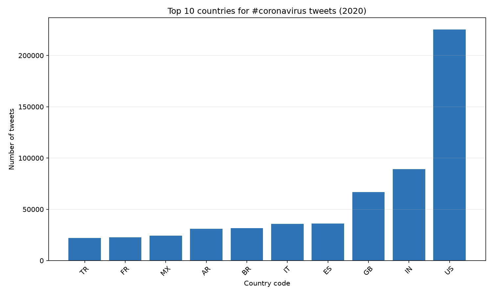
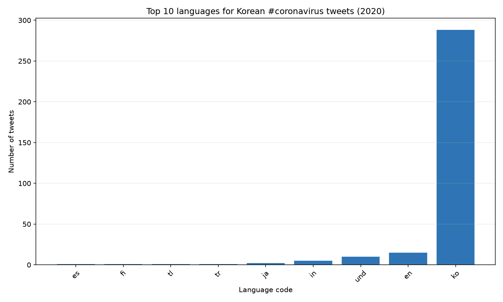
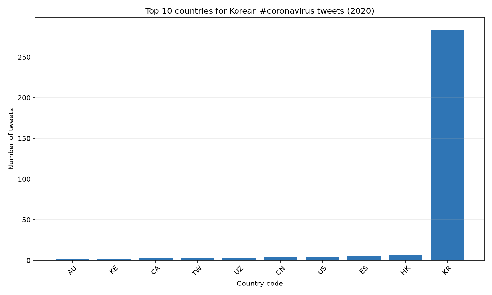
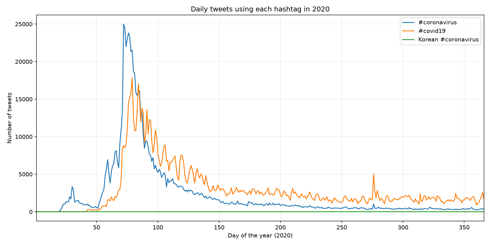

# Coronavirus Twitter Analysis

I analyzed every geotagged tweet sent in 2020 (about 1.1 billion tweets across 366 daily ZIP files) to track how coronavirus hashtags spread across languages and countries.

**How it works (MapReduce):**
- `src/map.py` scans one day of tweets and counts, for each hashtag in `hashtags`, how many tweets used it in each language and in each country.
- `run_maps.sh` launches one mapper per day in parallel with `nohup` and `&`, so all 366 days run at the same time on a shared server and keep running after logout.
- `src/reduce.py` combines the 366 daily outputs into yearly totals.
- `src/visualize.py` plots the top 10 languages or countries for a hashtag.
- `src/alternative_reduce.py` plots how often each hashtag was used on each day of 2020.

## #coronavirus by language

## #coronavirus by country

## #코로나바이러스 by language

## #코로나바이러스 by country

## Daily hashtag usage in 2020

